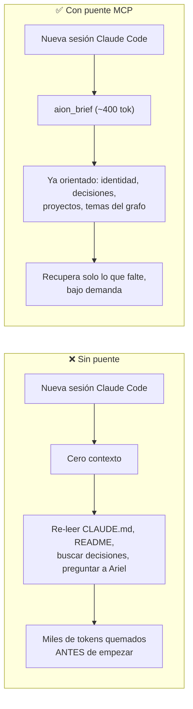
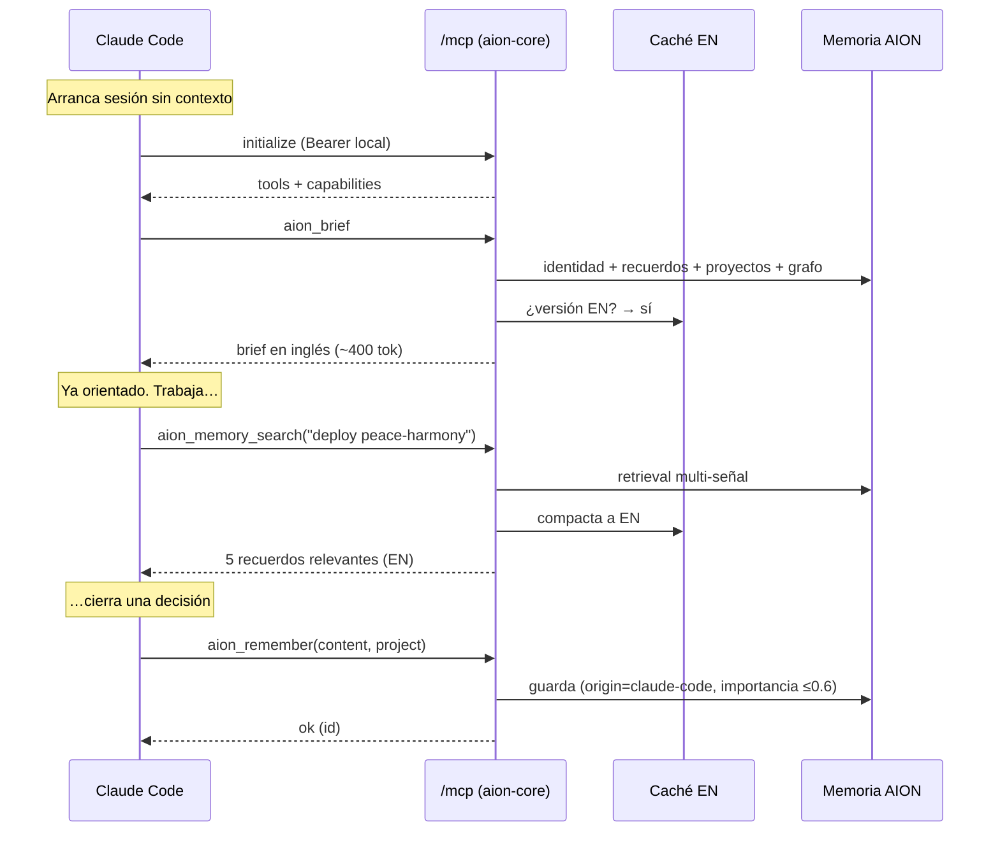

# La memoria de AION para Claude Code (puente MCP)

> Cómo AION le presta su memoria persistente a Claude Code para que **empiece cada
> sesión ya con contexto**, sin re-leer el repo ni repetir decisiones — y cómo eso
> **ahorra tokens** de forma medible.

---

## TL;DR

Claude Code (Anthropic, **de pago por token**) arranca cada sesión *sin memoria*. AION
(local, **inferencia gratis**) sí recuerda: preferencias de Ariel, decisiones de
arquitectura, proyectos, documentos. El **puente MCP** expone esa memoria a Claude Code
como 8 herramientas. Resultado:

- **Contexto en 1 llamada** (`aion_brief`, ~400 tokens) en vez de re-leer ficheros (miles de tokens).
- **Recuperación selectiva**: traes solo el hecho relevante, no el archivo entero.
- **Compactación ES→EN**: la memoria de Ariel está en español/italiano (cuestan **~40 % más
  tokens** que el inglés); el puente sirve una traducción inglesa equivalente hecha por
  **Gemma local (gratis)** y **cacheada**. Hoy hay **1 394** traducciones precomputadas.

Todo local, autenticado y auditado. Nada sale del dispositivo.

---

## 1. El problema



Dos asimetrías que el puente explota:

| | AION (local) | Claude Code (nube) |
|---|---|---|
| Coste de tokens | **0** (Gemma on-device) | **se paga cada token** |
| Memoria entre sesiones | **persistente** (years) | **ninguna** (arranca en blanco) |
| Idioma de la memoria | español/italiano | indiferente (pero ES/IT cuesta +40 %) |

La idea central: **mover el trabajo caro (recordar, traducir, resumir) al lado gratis
(AION/Gemma), y entregarle a Claude Code solo el destilado mínimo en el idioma más barato.**

---

## 2. Qué es y cómo encaja

`aion-core` (el daemon Rust) expone un endpoint **`/mcp`** que habla el
**Model Context Protocol** (JSON-RPC 2.0 sobre HTTP "streamable", protocolo `2025-06-18`).
Claude Code se conecta a él como a cualquier servidor MCP.

```mermaid
flowchart TB
    CC["🤖 Claude Code\n(sesión de pago por token)"]
    subgraph DAEMON["aion-core · daemon local :8765 (Rust + Axum)"]
        MCP["/mcp · JSON-RPC 2.0\nclaude_mcp.rs"]
        COMP["mcp_compact.rs\n(traducción ES→EN cacheada)"]
        MEM[("Memoria vectorial\ndarwiniana")]
        EPI[("Episódica\nepisodic.jsonl")]
        LIB[("Biblioteca RAG\nBGE-M3")]
        GRAPH[("Grafo de\nconocimiento")]
        GEMMA["Gemma 12B local\n(traduce gratis)"]
    end
    CC <-->|"Bearer local\n8 tools"| MCP
    MCP --> COMP
    COMP -.->|cache miss\n(2º plano)| GEMMA
    MCP --> MEM & EPI & LIB & GRAPH
```

- **Núcleo:** `apps/aion-core/src/claude_mcp.rs` (las tools + el JSON-RPC).
- **Ahorro de tokens:** `apps/aion-core/src/mcp_compact.rs`.
- **Conexión y brief:** `apps/aion-core/src/claude_code.rs`.
- **Almacén:** los mismos JSONL/índices que usa AION para sí mismo — el puente **no
  duplica datos**, solo los proyecta.

---

## 3. Las 8 herramientas

| Herramienta | Qué hace | Cuándo usarla | Coste típico |
|---|---|---|---|
| **`aion_brief`** | Resumen compacto: identidad + recuerdos recientes de-duplicados + proyectos + biblioteca + resumen del grafo | **1 vez** al empezar la sesión | ~400 tok |
| **`aion_memory_search`** | Busca recuerdos del usuario (preferencias, decisiones) por significado, multi-señal | Antes de asumir contexto de Ariel o un proyecto | ~50–300 tok |
| **`aion_episodic_recall`** | Trae **micromomentos** exactos de charlas pasadas (qué se dijo, cuándo) | Cuando necesitas un detalle puntual de una conversación | bajo demanda |
| **`aion_library_search`** | RAG sobre documentos ingeridos (vectorial + grafo), devuelve pasajes con fuente | Preguntas sobre PDFs/manuales de Ariel | por pasajes |
| **`aion_graph_query`** | Consulta el grafo de conocimiento (local: multi-salto; global: temas/comunidades) | Relaciones entre conceptos o panorama temático | medio |
| **`aion_project_context`** | Lista proyectos del workspace o el contexto de uno (fuentes) | Orientación sobre en qué se trabaja | bajo |
| **`aion_remember`** | **Guarda** una decisión/hecho durable (etiquetado por proyecto) | Al cerrar una decisión durable | escritura |
| **`aion_forget`** | Borra recuerdos por id (**destructivo**, solo a petición explícita) | Purgar recuerdos erróneos | escritura |

Las descripciones de cada tool están escritas para **enrutar bien**: p. ej. `aion_brief`
avisa de que tras llamarlo *no* hace falta `aion_graph_query` global para orientarse — evita
llamadas redundantes (y tokens).

---

## 4. Cómo ahorra tokens (el núcleo)

Tres palancas, de mayor a menor impacto:

### 4.1 · Brief-once en vez de re-descubrir

Una llamada de ~400 tokens entrega lo que, sin puente, costaría leer `CLAUDE.md` + `README`
+ rebuscar decisiones (fácilmente **miles** de tokens) — y encima con el riesgo de *asumir*
mal. El brief ya viene **de-duplicado** y resumido por AION.

### 4.2 · Recuperación selectiva

`aion_memory_search` / `aion_library_search` devuelven **solo el hecho o pasaje relevante**,
no el documento entero. El razonamiento lo pone Claude Code; el dato, AION.

### 4.3 · Compactación ES→EN (la palanca silenciosa)

```mermaid
flowchart LR
    Q["Claude Code pide\nun recuerdo"] --> H{¿hay traducción\nEN cacheada?\n(hash del texto)}
    H -->|sí 99%| EN["Sirve INGLÉS\n(~40% menos tokens)"]
    H -->|no| ES["Sirve ESPAÑOL original\n(fail-open: Claude lo entiende)"]
    ES -.->|dispara en 2º plano| G["Gemma local traduce\n(gratis) y cachea"]
    G -.->|lista para la próxima| EN
```

La memoria de Ariel vive en español/italiano. El mismo hecho en inglés ocupa **~40 % menos
tokens** (medido con tiktoken sobre recuerdos reales). El puente:

1. Guarda y le sirve a Gemma la memoria **siempre íntegra en su idioma** (el chat local es gratis).
2. **Solo al puente MCP** le entrega una versión **inglesa equivalente** — traducción fiel
   hecha por **Gemma local** (coste $0), no un quita-palabras.
3. La **precomputa y cachea por hash de contenido** (`mcp_compact_en.json`): nunca traduce
   en caliente dentro de la llamada (eso metería latencia).
4. **Fail-open absoluto:** si aún no hay traducción, sirve el español (Claude lo entiende
   igual) y dispara la traducción en segundo plano para la próxima vez.
5. **Se mide:** cada llamada MCP registra cuántos caracteres ahorró la traducción (auditoría).

**Datos reales hoy** (esta instalación): **1 394** traducciones cacheadas (372 KB), y un
*warmer* de arranque pre-traduce los recuerdos recientes para que **incluso la primera
consulta** de la sesión ya salga en inglés.

> Por qué solo aquí: el chat de AION con Gemma es gratis, así que comprimir *eso* no ahorra
> nada. El único punto donde un token cuesta dinero es el contexto de Claude Code → el ahorro
> se ata al **consumidor**, no al almacenamiento.

---

## 5. Anatomía de una sesión



---

## 6. Seguridad y gobernanza

- **Bearer local estable.** `/mcp` exige un token Bearer propio, persistido (`api_token`,
  permisos 0600) y comparado *timing-safe*. Sobrevive a reinicios y actualizaciones OTA
  (si fuera efímero, cada update rompería la conexión).
- **Excepción de Origin controlada.** Claude Code no es un navegador y postea sin `Origin`;
  `/mcp` queda fuera de la exigencia de Origin pero **solo** porque tiene su Bearer propio.
- **Procedencia y tope de confianza.** Todo lo que Claude Code escribe con `aion_remember`
  se marca `origin: "claude-code"` con **importancia ≤ 0.6** (`MAX_EXTERNAL_IMPORTANCE`):
  un agente externo no puede plantar recuerdos de máxima prioridad en la mente de AION.
- **Auditoría.** Cada `tools/call` deja constancia (incluido el ahorro de tokens medido).
  `aion_forget` es destructivo y solo se usa a petición explícita del usuario.
- **Visibilidad para AION.** Los recuerdos escritos por Claude Code aparecen en la **Bandeja**
  de AION: él *ve* que su compañero de código le dejó una nota.

---

## 7. Cómo se conecta (sin fricción)

`aion-core` **se registra solo** editando `mcpServers.aion` directamente en `~/.claude.json`
(de forma atómica, sin exponer el token en la línea de comandos). Como el token es estable,
la conexión **sobrevive a las actualizaciones** sin re-sincronizar. Al arrancar el daemon,
si la entrada no existe o el token cambió, se reescribe.

```jsonc
// ~/.claude.json (gestionado por aion-core)
"mcpServers": {
  "aion": {
    "type": "http",
    "url": "http://127.0.0.1:8765/mcp",
    "headers": { "Authorization": "Bearer ••••••" }
  }
}
```

---

## 8. El stack que lo hace posible

| Pieza | Tecnología | Rol en la memoria |
|---|---|---|
| Daemon | **Rust + Axum** (`aion-core`) | Endpoint `/mcp`, JSON-RPC, auth |
| Protocolo | **MCP `2025-06-18`** (JSON-RPC 2.0, HTTP streamable) | Hablar con Claude Code |
| Traducción | **Gemma 12B local** (vía Ollama) | ES/IT → EN, gratis, fiel |
| Caché | **JSON por hash sha256** (`mcp_compact_en.json`) | No retraducir nunca lo mismo |
| Memoria | **vectorial darwiniana + episódica (JSONL)** | Recuerdos y micromomentos |
| RAG | **BGE-M3 (1024d)** + grafo | Biblioteca de documentos |
| Grafo | **GAAMA-KG** (lazy, incremental) | Relaciones y temas |

---

## Resumen

El puente MCP convierte a AION en la **memoria de largo plazo de Claude Code**: lo que es
caro (recordar, traducir, resumir) ocurre en el lado **local y gratis**; a la sesión de pago
solo llega el **destilado mínimo, en el idioma más barato, autenticado y auditado**. El
efecto práctico: Claude Code arranca sabiendo quién es Ariel y en qué andamos, gasta menos
tokens y no inventa contexto.

*Código: [`claude_mcp.rs`](../apps/aion-core/src/claude_mcp.rs) · [`mcp_compact.rs`](../apps/aion-core/src/mcp_compact.rs) · [`claude_code.rs`](../apps/aion-core/src/claude_code.rs). Visión general en el [README](../README.md).*
